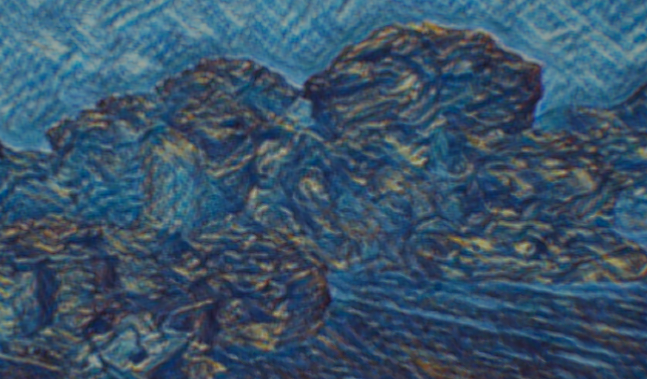
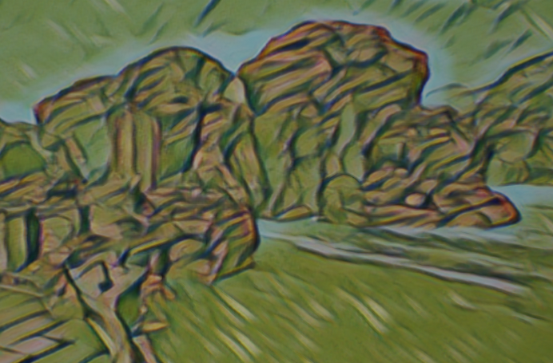
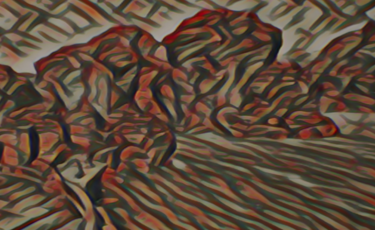
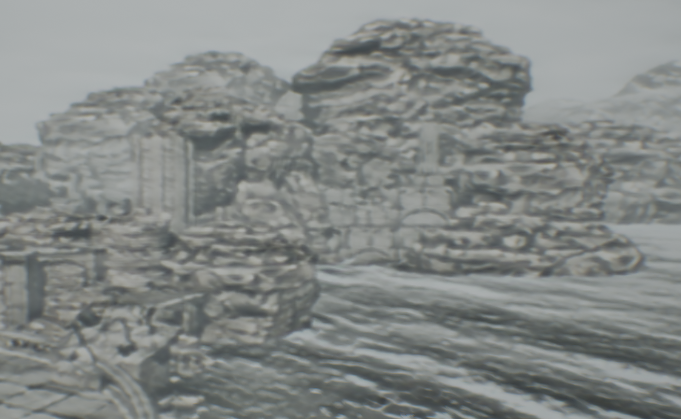
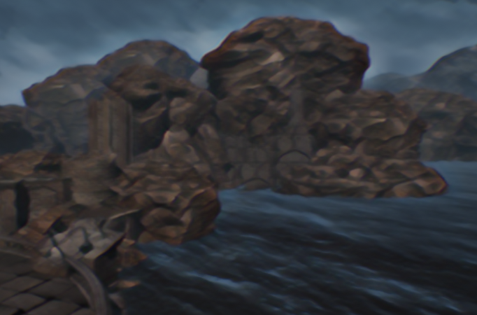
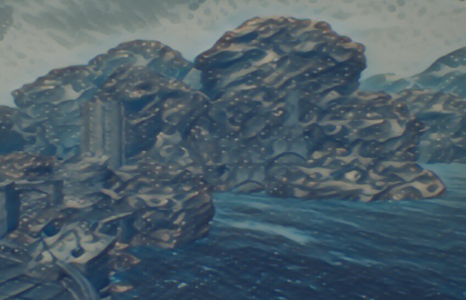
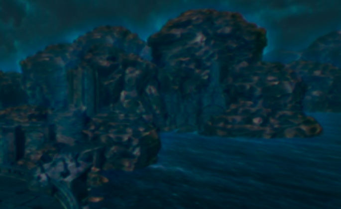
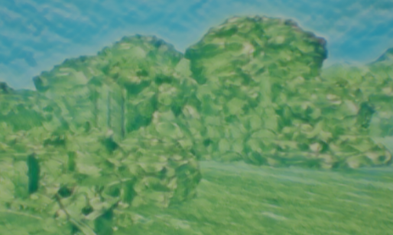

# NNPP
A UE4 Plugin of Neural Network Style Transfer for Post Processing

## Sample Image
### Starry Night

### La Muse

### Mirror

### Starry Night

### Sketch

### Udnie

### Wave Crop

### Ori

### Zelda

## Sample Video

